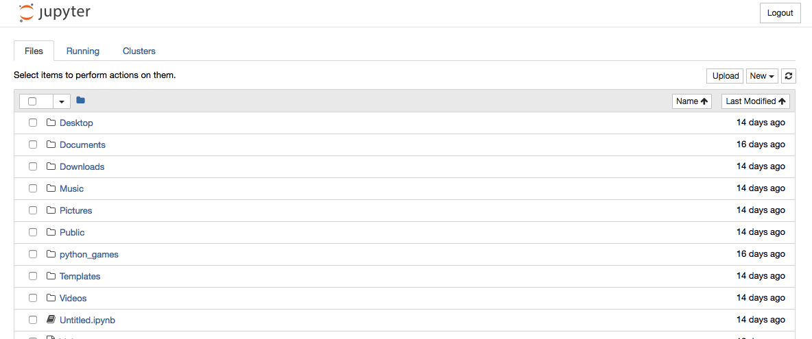
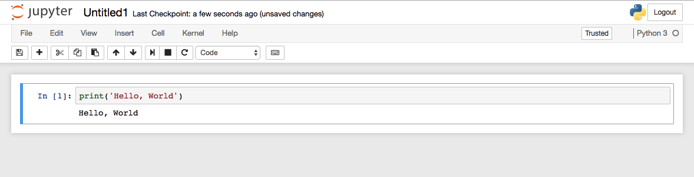

The Jupyter Notebook is an open-source web application you can use to create and share documents that contain live code, equations, visualizations, and explanatory text. It is a great tool for editing Python code, especially if you are working with charts and plotting data and need to make small edits to your code on the fly. Because it is an online tool, it is also useful if you want to test and edit code without having your Pi connected to a monitor and keyboard, e.g. when you're building a robot.

### Installing

- Install Jupyter Notebook with pip:

    ```bash
    sudo pip3 install jupyter
    ```


This may take a while, especially on an older Pi or a Pi Zero, as lots of other required libraries will be installed too.  

- Then generate a default configuration file:

    ```bash
    jupyter notebook --generate-config
    ```


- Next, set a password:

    ```bash
    jupyter notebook password
    ```


### Network configuration

**Note:** If you're just going to use Jupyter locally on the Pi, then skip this step.

- Now you need to set the IP address on which Jupyter will serve pages. Open the configuration file using your favourite editor (e.g. nano):

    ```bash
    nano .jupyter/jupyter_notebook_config.py
    ```

- Find this line:

```
#c.NotebookApp.ip = "localhost"
```  

- Remove the comment symbol `#` at the start, and replace the `localhost` bit between the `""` symbols with the IP address of the Pi. For example:

```
c.NotebookApp.ip = "192.168.1.200"
```  

- Save the file and exit.

### Testing

- Now test your installation by typing the following into a terminal window:

```bash
jupyter Notebook
```

- Then open a browser, either on the Pi for local uses, or on a machine on the same network if you want to access the Pi remotely. Type the appropriate address into the URL bar:

http://localhost:888: (local)
http://ipaddress:8888 (remote)

You should see a page like the one below.


- Enter the password you set earlier. Now you should a directory listing of `/home/pi`.



- Click the **New** button on the right of the screen. This will open a new Notebook session.


