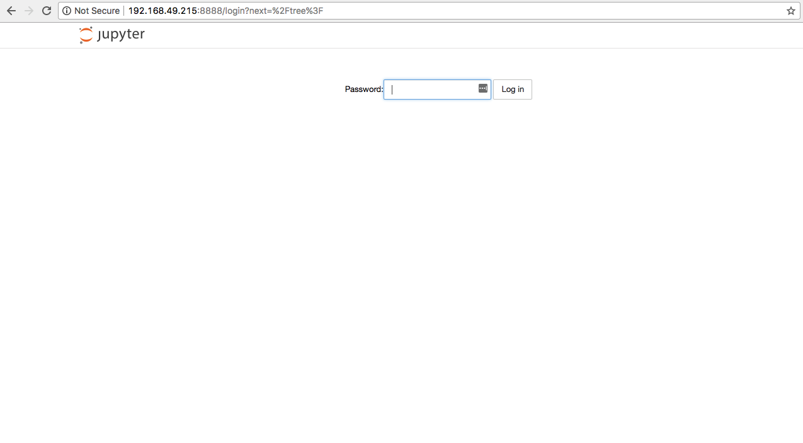

The Jupyter Notebook is an open-source web application that allows you to create and share documents that contain live code, equations, visualizations and explanatory text.  It is a great tool for editing Python code, especially if you are working with charts and plotting data and need to make small, on-the-fly edits to your code. Because it is web based, it is also useful if your Pi is running headless and you want to test and edit code without having the Pi connected to a monitor and keyboard (e.g. if you're building a robot).

### Installing

- Install Jupyter Notebook with pip:

    ```bash
    sudo pip3 install jupyter
    ```


This may take a while, especially on an older Pi or a Pi Zero as lots of other required libraries will be installed too.  

- Then generate a default configuration file:

    ```bash
    jupyter notebook --generate-config
    ```


- Then set a password:

    ```bash
    jupyter notebook password
    ```


### Network Configuration

- If you're just going to use Jupyter locally on the Pi, then you skip the next next step Now you need to set the IP address that Jupyter will serve pages on. Open the configuration file using your favourite editor (e.g. nano):

    ```bash
    nano .jupyter/jupyter_notebook_config.py
    ```

- Find the line:

    ```
    c.NotebookApp.ip = "localhost"
    ```

- Remove the comment symbol at the start and change it to:

```
c.NotebookApp.ip = "<ip address>"
```

where _<ip address>_ is the IP address of the Pi. For example:

```
c.NotebookApp.ip = "192.168.1.200"
```

- Save the file and exit.

### Testing

- Now test your installation by running:

```bash
jupyter Notebook
```

- Then open a browser either on the Pi (for local only configurations) or on a machine on the same network (remote).  Type the appropriate address into the URL bar:

http://localhost:888: (local)
http://<ipaddress>:8888 (remote)

You should see a page like the one below.



- Enter the password you set earlier. Now you should a directory listing of `/home/pi`.


- Click on the `New` button to the right of the screen. This will open a new Notebook session.


